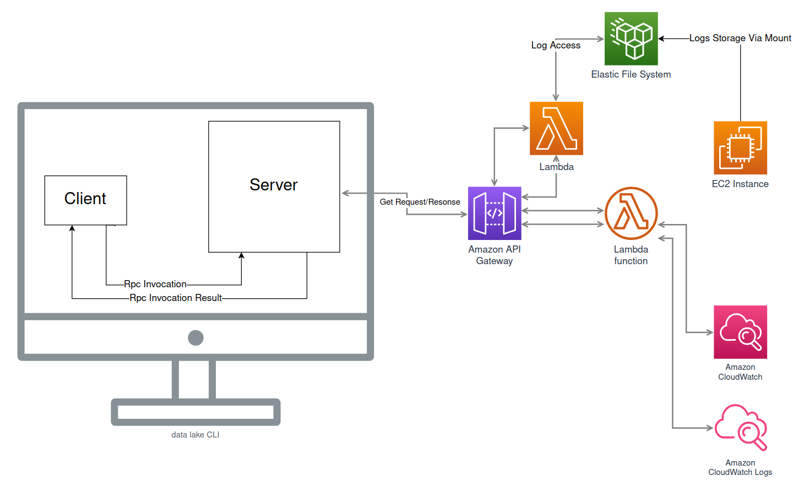
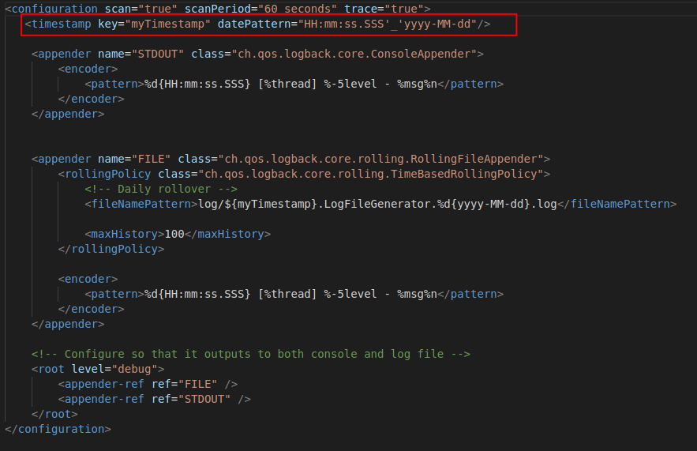

# RestAPI-Search


Name = **Muhammad Abrar Tariq**

### Link Demonstrating deployment **[Video](https://drive.google.com/drive/folders/1QsBj7ddcb8OfHoBfcEoSnL646vOoiVy-?usp=sharing)**

### Steps to Set-up Environment.

* Cloning the Project -
 
```git clone https://github.com/abrartariq/RestAPI-Search```


      *Install IntelliJ or your preferred IDE. This application was developed using IntelliJ, which is highly recommended for various reasons.
      *Ensure that you have at least Java SDK version 8 installed on your machine.
      *Verify that Git (version control) is installed on your machine. If not, please install it.
      *Open IntelliJ and import the project into the IDE environment. Alternatively, choose New -> Project from Version Control, and enter the GitHub URL of this repository to load it directly into your system if not already cloned.
      *The application is written in Scala programming language, using version 2.13.10.
      *To build the project, I used sbt (Scala's Simple Build Tool), specifically version 1.7.2.
      *You can find all dependencies and build settings in the build.sbt file.
      *Once IntelliJ has successfully detected the appropriate Scala and sbt versions, the project is ready to be compiled/built.
      *Open the terminal at the bottom of IntelliJ or use any terminal with the path set to the project's root directory.
      *Enter sbt clean compile to start building the project.
      *During compilation, the process generates stubs from the Protobuf file (.proto), which can then be imported into client and server programs, as demonstrated in this project.
      *The Protobuf file is located at src/main/protobuf/log.proto.
      *Test cases are written using the ScalaTest library.
      


## Project Overview
This project consists of three main tasks:

1. Implement a local gRPC client and server where the client calls the server, and the server calls an AWS Lambda function.
2. Develop a REST client using [AKKA](https://akka.io/) and [STTP3](https://sttp.softwaremill.com/en/stable/) that calls a GET method, which in turn invokes an AWS Lambda function via Amazon API.
3. Deploy a LocalSearch program that scans files in a specified directory to confirm the results obtained from the AWS Lambda function (Self Not Required).

## Task Details
### Task 1
Determine if logs contain messages within a specific range based on the inputs, including a timestamp (< hh:mm:ss.SSS >) and a time range (< ss >), representing the time interval (t - dt : t + dt). => **Dealt by using a Modified LogGenerator that add the creation timeStamp to FileName**

### Task 2
Return an MD5 hash of a concatenated string, formed by extracting all messages within the specified time interval in Task 1, matching a predefined regex pattern which can be set as an input to the Lambda function. => **Dealt by Doing binary Search on Files to Concant Valid files only in minimal Time** 


## Core
1. Get the list of File names

```
1- 03:11:44.298_2022-10-30.LogFileGenerator.2022-10-30.log
2- 03:14:19.193_2022-10-30.LogFileGenerator.2022-10-30.log
3- 03:22:48.691_2022-10-30.LogFileGenerator.2022-10-30.log
4- 03:23:56.957_2022-10-30.LogFileGenerator.2022-10-30.log
5- 03:25:07.824_2022-10-30.LogFileGenerator.2022-10-30.log
6- 03:26:17.401_2022-10-30.LogFileGenerator.2022-10-30.log
7- 03:27:22.451_2022-10-30.LogFileGenerator.2022-10-30.log
8- 03:28:34.758_2022-10-30.LogFileGenerator.2022-10-30.log

```
2. Assume our Time Stamp is Window time = 03:22:00.000 and Delta time = 00:05:00.000. 
3. We will first Convert it in to StartTime and EndTime Metrics as shown in Task 1 
```
StartTime = 03:17:00.000 , EndTime = 03:27:00.000
```
4. Now We Do binarySearch For Both **Times** to find the Highest Floor and Lowest Ceiling respectivly.
```
HighestFloor = 03:14:19.193  LowestCeiling = 03:26:17.401
```
5. Now We just have to match the pattern provided and Concat the Messages present in the files that Satisfy the constraint (File Range [2,6])
6. Finally we Take MD5 of the messages and Send it back. 

The Core Functionality is implemented in AWS lambda Function is Written in Python and a LocalSearch Module Written in Scala.


## Key Components


### [gRPC](src/main/scala/GrpcSearch)
| Name | Description |
| :---: | :---: |
| [grpcClient](src/main/scala/GrpcSearch/grpcClient.scala) | The local client that invokes the [grpcServer](src/main/scala/GrpcSearch/grpcServer.scala) using functions defined in [log.proto](src/main/protobuf/log.proto). |
| [grpcServer](src/main/scala/GrpcSearch/grpcServer.scala) | The local server that listens for client calls to invoke a GET call to the AWS Lambda using [STTP3](src/main/scala/RestApi/RestClient). |

### [REST](src/main/scala/RestApi)
| Name | Description |
| :---: | :---: |
| [RestClient](src/main/scala/RestApi/RestClient.scala) | A class that invokes the AWS Lambda function using Amazon API RESTful service, utilizing AKKA's actor system for functionality. |

### [LocalSearch](src/LocalSearch/)
| Name | Description |
| :---: | :---: |
| [LocalSearch](src/main/scala/LocalSearch/ClientSearch.scala) | A local search instance that examines files with the same implementation as the AWS Lambda function but adapted to work on the local system. Written in Scala as opposed to the AWS Lambda's Python. |

### [Test](src/test/scala/test/)
| Name | Description |
| :---: | :---: |
| [test](src/test/scala/test/) | Utilizes ScalaTest to perform 10 unit tests, verifying nearly every modular function of the project. |

### [LogGen](LogFileGenerator/runloggen.sh)
| Name | Description |
| :---: | :---: |
| [LogGen](LogFileGenerator/) | A modified log generator with minor tweaks, such as logging modifications. It creates a variable that adds a timestamp to the file name, which is later used to narrow down files in an O(log(n)) manner. A bash file can be used to run it periodically, with a 5-minute gap. |


## Setup and Execution
1. Clone the project using `git clone https://github.com/abrartariq/RestAPI-Search`
2. Execute `sbt clean compile`

### REST Client
3. Enter the sbt shell using `sbt`
4. Execute `sbt "runMain RestApi.RestClient"`

### gRPC Client and Server
5. Open two terminal windows
6. Start the server on one terminal
   1. Execute `sbt "runMain GrpcSearch.grpcServer"`
7. Start the client on the other terminal
   1. Execute `sbt "runMain GrpcSearch.grpcClient"`
   2. Wait for the results

### LocalSearch
8. SCP Files out OF EFS and Place them in Folder = "logs/" in the main Directory
9. Execute `sbt "runMain LocalSearch.ClientSearch"`

### Testing
10. Execute `sbt test`


### AWS Deployment
1. Start an EC2 instance and SSH into it.
2. Mount an EFS system to your EC2 instance.
3. Clone the project `git clone https://github.com/abrartariq/RestAPI-Search` or SCP files directly into EFS storage.
4. Run the BashScript present in [LogGen](LogFileGenerator/runloggen.sh). It will run slower due to direct execution from the EFS system, but this saves extra time from transferring files into S3 or another folder in EFS.
5. Access your files in the Lambda function by importing OS `os.listdir("/mnt/efsas/")`.

### System Overview
## 1. Grpc Impl

## 2. REST Impl


## Results
### 1. REST Client

### 2. Log Generator

### 3. gRPC Client/Server

### 4. LocalSearch

### 5. ManualResult


## References
1. [ScalaPB gRPC](https://scalapb.github.io/docs/grpc)
2. [AKKA GET Request (HTTP)](https://github.com/akka)
3. [gRPC Client Server Setup](https://github.com/xuwei-k/grpc-scala-sample)
4. [STTP3 Simple Http Get Request](https://sttp.softwaremill.com/en/stable/)
